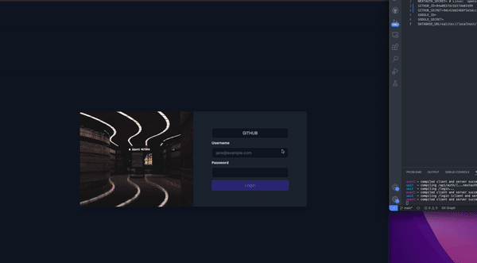

# AnalyticsFactory

## XGB

- https://coiled.io/blog/apple-arm64-mambaforge/

- https://stackoverflow.com/questions/63790955/xgboost-could-not-be-loaded-in-mac

- https://github.com/aimhubio/aim/blob/main/examples/xgboost_track.py

- https://www.kaggle.com/robikscube/tutorial-time-series-forecasting-with-xgboost

- https://towardsdatascience.com/full-stack-machine-learning-on-azure-f0f6b77be07e

- https://medium.com/@wizart_tech/dockerized-apache-airflow-as-a-single-tool-for-automating-etl-pipelines-for-ml-and-bi-needs-300bb5ab00ab

- https://medium.com/@schinas.georgios/create-a-sagemaker-pipeline-utilising-a-custom-callback-step-31219f63db88
